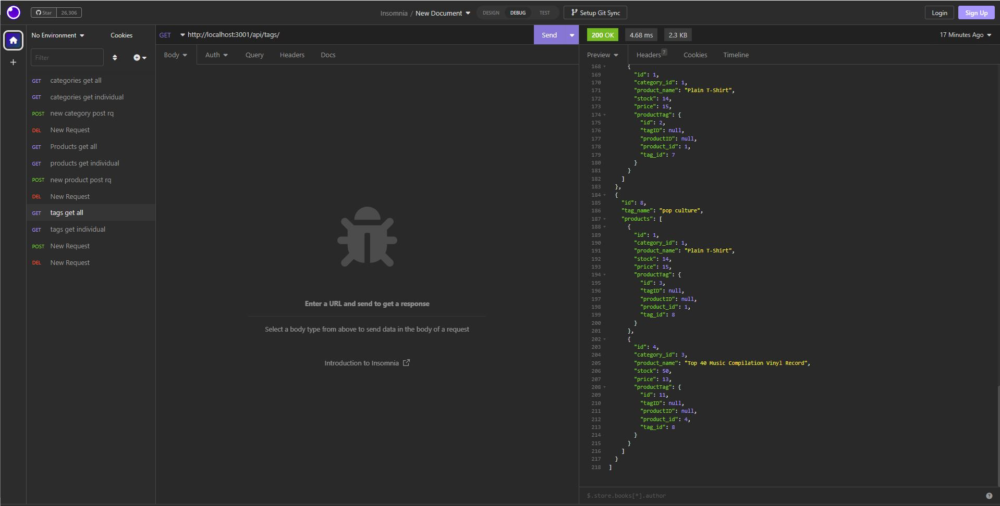

# ORM-E-Commerce-Backend

## Description

This back-end app allows users to interact with a mysql database using an object relational mapping plugin called sequelize. This ORM helps users quickly and efficiently
see what is available in the database, add to the database and delete from the database. 

## Installation

Users can install the apropriate NPM packages using NPM I command.
Users will also need to create a dotenv file with their corresponding username and password for mySQL

## Usage

This project allows users to easily interact with a ecommerce backend database.

## Contributors

Jacob Van Dyke: 

github.com/jacobvandyke194

Below is the link to the video demo:

https://drive.google.com/file/d/1tchZNPVb1WsFzIgi35K9n7pPZWchQOAR/view 

## Screenshot of Website

